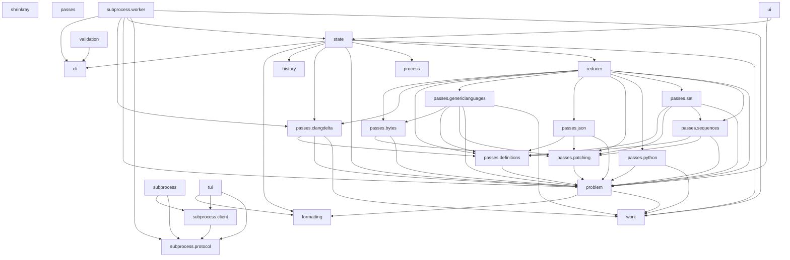

# Import Graph

This diagram shows the internal import dependencies between modules in `src/shrinkray/`.

External dependencies (trio, attrs, etc.) are not shown.

---
*This file is auto-generated by `scripts/update_import_graph.py`*
